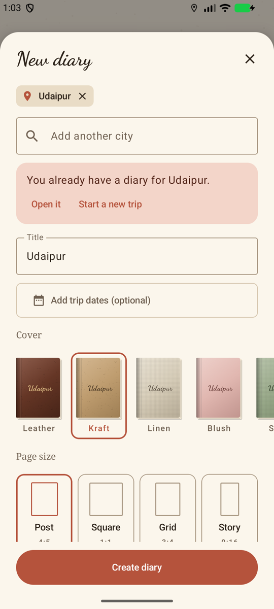

# Travel Diary (working title: Wanderpage)

An Android travel journal that turns each trip into a scrapbook-style book: cursive notes, photo cut-outs with the background removed, scanned receipts and tickets, washi tape and paper textures. Every page is sized for an Instagram post or story, so it's ready to share.

## Docs
- [`docs/PRD.md`](docs/PRD.md): product requirements (screens, motion spec, tech approach, release plan)
- [`docs/DEVELOPMENT_NOTES.md`](docs/DEVELOPMENT_NOTES.md): decisions so far, chosen stack, and where development picks up
- [`docs/references/`](docs/references/): the visual references the look is based on

## Status
In development, following the MVP build order in the development notes.

| Step | State |
|---|---|
| 1. Project skeleton (theme, Room schema, repository) | Done |
| 2. Home shelf and create-diary sheet | Done |
| 3. Book view | Next |
| 4–9. Page zoom, editor, elements, export, map, polish | Not started |

 

## Build
The Gradle project is at the repo root, with the app module in [`app/`](app/).

```bash
./gradlew assembleDebug
```
