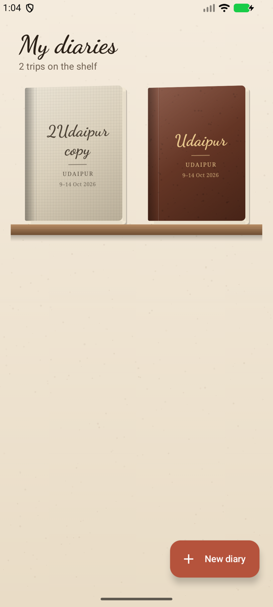
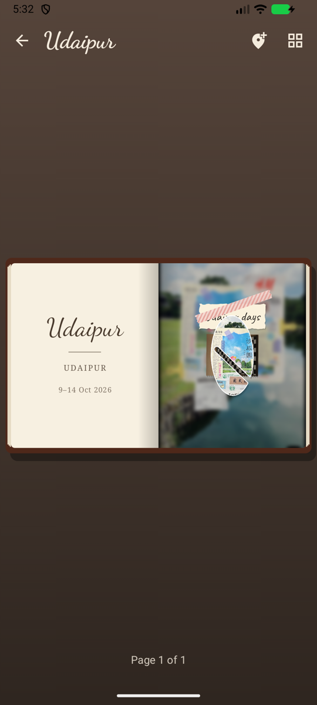
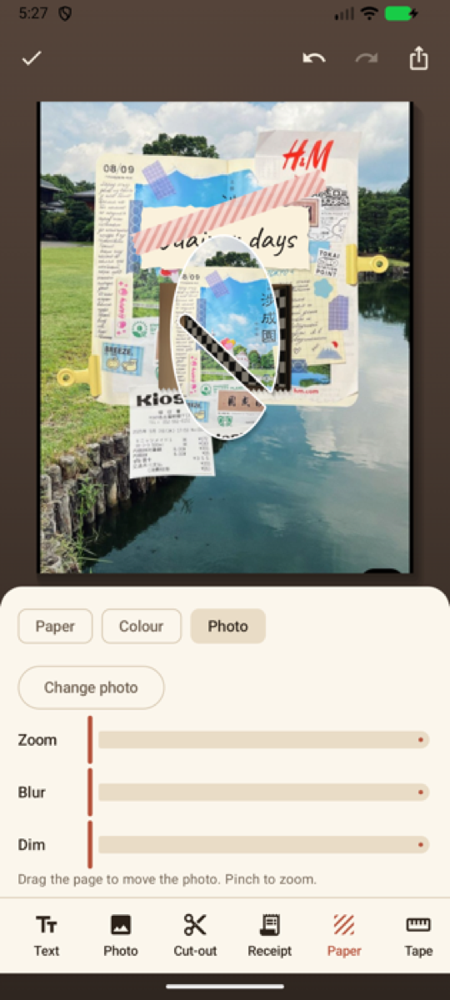
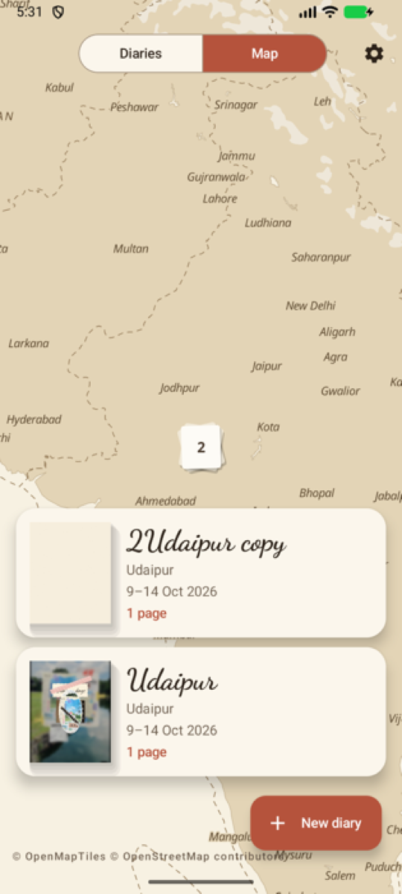

# Travel Diary (working title: Wanderpage)

An Android travel journal that turns each trip into a scrapbook-style book: cursive notes, photo cut-outs with the background removed, scanned receipts and tickets, washi tape and paper textures. Every page is sized for an Instagram post or story, so it's ready to share.

## Docs
- [`docs/PRD.md`](docs/PRD.md): product requirements (screens, motion spec, tech approach, release plan)
- [`docs/DEVELOPMENT_NOTES.md`](docs/DEVELOPMENT_NOTES.md): decisions so far, chosen stack, and where development picks up
- [`docs/references/`](docs/references/): the visual references the look is based on

## Status
The MVP build order (steps 1 to 9 in the development notes) is implemented and runs on Android 8 and later.
See "Known gaps" in [`docs/DEVELOPMENT_NOTES.md`](docs/DEVELOPMENT_NOTES.md) for what is simplified or untested.

   

## Build
The Gradle project is at the repo root, with the app module in [`app/`](app/).

```bash
./gradlew assembleDebug
```

A minified APK for sideloading, signed with the debug key:

```bash
./gradlew assembleRelease
```

## Layout
- `data/`: Room entities and DAO, the repository, image storage, settings
- `ui/page/`: `PageSurface`, the single page renderer used by the book, editor and export, plus fonts, papers, tapes and shapes
- `ui/home/`, `ui/book/`, `ui/editor/`, `ui/export/`, `ui/map/`, `ui/settings/`: one folder per screen
